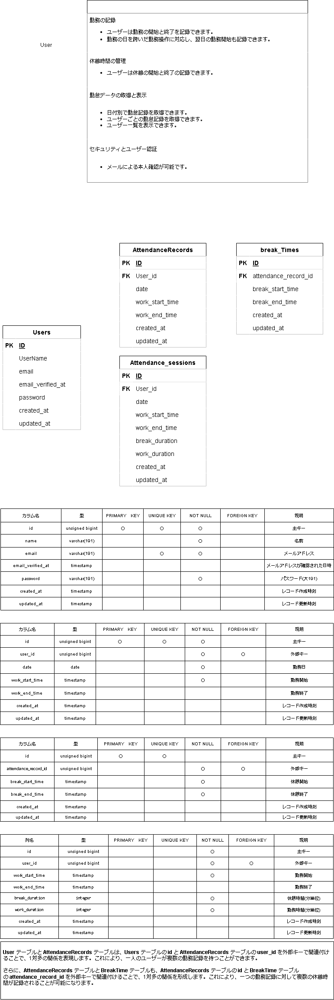

## Atte（アット）勤怠管理システムアプリ

### サービス概要

Atteは、企業の勤怠管理システムです。ユーザーは勤務の開始と終了を記録し、休憩時間の管理も行うことができます。日付別やユーザーごとに勤怠データを取得し、表示する機能も備えています。

### 制作の背景と目的

このシステムは、企業内での人事評価の精度を向上させるために開発されました。正確な勤務記録に基づいて、従業員の評価を行うことが可能になります。

### 制作の目標

- 利用者数100人を達成すること。
- ユーザーが直感的に操作できるシンプルなインターフェースを提供する。
- 安全かつ正確に勤怠データを管理し、企業の人事評価に貢献する。

### 主な機能一覧

- **勤務記録の管理**: ユーザーは勤務の開始と終了を記録できます。日を跨ぐ勤務にも対応しています。
- **休憩時間の管理**: 休憩の開始と終了を記録し、管理することが可能です。
- **勤怠データの取得と表示**: 日付別、ユーザーごとに勤怠記録を取得し、表示することができます。ユーザー一覧も表示可能です。
- **セキュリティとユーザー認証**: メールによる本人確認を提供し、セキュリティを強化しています。

### 登録プロセス

- ユーザはメールアドレスと強力なパスワードを使用してアカウントを作成します。
- パスワードは８文字以上少なくとも大文字一つ以上含まれる必要があります。

### データモデル

- **UserテーブルとAttendanceRecordsテーブル:** Users テーブルの `id` と AttendanceRecords テーブルの `user_id` を外部キーで関連付けることにより、1対多の関係を表現します。これにより、一人のユーザーが複数の勤務記録を持つことができます。

- **AttendanceRecords テーブルと BreakTime テーブル**: AttendanceRecords テーブルの `id` と BreakTime テーブルの `attendance_record_id` を外部キーで関連付けることで、1対多の関係を形成します。これにより、一つの勤務記録に対して複数の休憩時間が記録されることが可能になります。

### アプリケーションURL
- 勤怠管理システム「Atte」の会員登録ページはこちらからアクセスできます: [会員登録ページ](http://54.95.1.173/register)

### セキュリティ
- パスワードは８文字以上で少なくとも一つの大文字が必要です。
  
### 使用技術（実行環境）

- **開発言語**: PHP
- **フレームワーク**: Laravel 8.x
- **データベース**: MySQL
- **バージョン管理**: GitHub
- **コンテナ化技術**: Docker

### テーブル設計・ER図

### 環境構築

- **PHP**: 8.3.0
- **MySQL**: 8.0.26
- **Composer**: 2.2.6
- **Docker**: 26.0.0
- **Laravel Framework**: 8.83.27

### インストールの方法

- 必要なディレクトリの作成、以下のディレクトリが存在しない場合は、作成してください。

 　bash
 　mkdir -p src/bootstrap/cache \
        src/storage \
        src/storage/framework/cache \
        src/storage/framework/cache/data \
        src/storage/framework/sessions \
        src/storage/framework/testing \
        src/storage/framework/views \
        src/storage/logs \
        src/storage/logs/app \
        src/storage/logs/app/public

### 依存関係のインストール

プロジェクトの依存関係をインストールします。

   bash
 　composer install

 **Dockerを使用している場合**

   docker-compose up -d --build

## 環境設定

1. プロジェクトをクローンします。
2. `.env.example` をコピーして `.env` ファイルを作成し、環境に合わせて変数を設定します。

   bash
   cp .env.example .env

3. 必要なディレクトリやファイルがない場合は、以下のコマンドでコンテナ内で作成します。

   bash
   cd docker/php
   docker-compose exec php bash

  - 不足しているファイルやディレクトリの作成

  - 権限の付与

   chown -R www-data:www-data /var/www/bootstrap/cache
   chmod -R 775 /var/www/bootstrap/cache

4. Laravel アプリケーションのキーを生成します。

   bash
   php artisan key:generate

5. コンテナから出ます。

   bash
   exit

6. サーバーを起動します。Dockerを使用している場合は、以下のコマンドでビルドします。

   bash
   docker-compose up -d --build

7. 設定をクリアします。

   bash
   php artisan config:clear
   php artisan cache:clear

8. データベース使用前には以下のコマンドでマイグレーションとシーディングを行ってください。

   php artisan migrate
   php artisan db:seed

### URL
- **開発環境:** [http://localhost/](http://localhost/)
- **phpMyAdmin:** [http://localhost:8080/](http://localhost:8080/)

