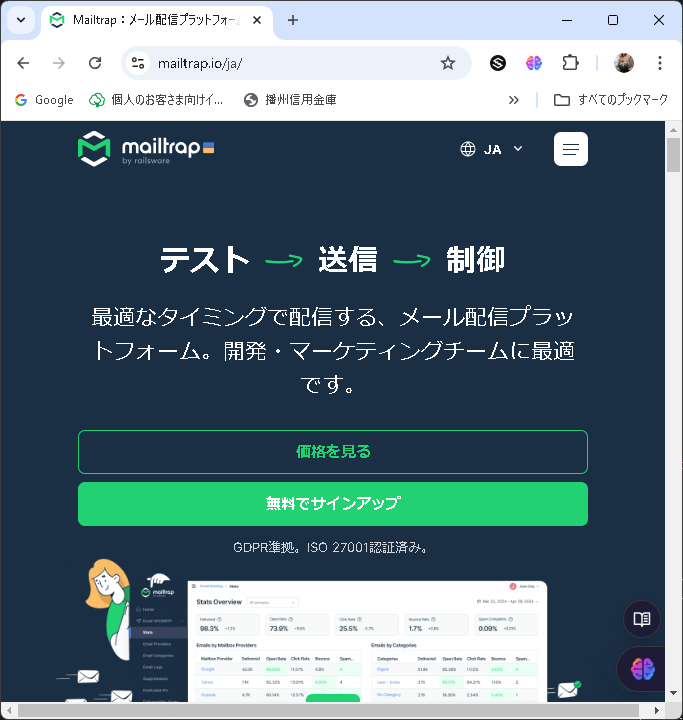

## Atte（アット）勤怠管理システムアプリ

### サービス概要

Atteは、企業の勤怠管理システムです。ユーザーは勤務の開始と終了を記録し、休憩時間の管理も行うことができます。日付別やユーザーごとに勤怠データを取得し、表示する機能も備えています。


### 制作の背景と目的

このシステムは、企業内での人事評価の精度を向上させるために開発されました。正確な勤務記録に基づいて、従業員の評価を行うことが可能になります。


### 制作の目標

- 利用者数100人を達成すること。
- ユーザーが直感的に操作できるシンプルなインターフェースを提供する。
- 安全かつ正確に勤怠データを管理し、企業の人事評価に貢献する。


### 主な機能一覧

- **勤務記録の管理**: ユーザーは勤務の開始と終了を記録できます。日を跨ぐ勤務にも対応しています。
- **休憩時間の管理**: 休憩の開始と終了を記録し、管理することが可能です。
- **勤怠データの取得と表示**: 日付別、ユーザーごとに勤怠記録を取得し、表示することができます。ユーザー一覧も表示可能です。
- **セキュリティとユーザー認証**: メールによる本人確認を提供し、セキュリティを強化しています。

### 登録プロセス

- ユーザはメールアドレスと強力なパスワードを使用してアカウントを作成します。
- パスワードは８文字以上少なくとも大文字一つ以上含まれる必要があります。

### データモデル

- **UserテーブルとAttendanceRecordsテーブル:** Users テーブルの `id` と AttendanceRecords テーブルの `user_id` を外部キーで関連付けることにより、1対多の関係を表現します。これにより、一人のユーザーが複数の勤務記録を持つことができます。

- **AttendanceRecords テーブルと BreakTime テーブル**: AttendanceRecords テーブルの `id` と BreakTime テーブルの `attendance_record_id` を外部キーで関連付けることで、1対多の関係を形成します。これにより、一つの勤務記録に対して複数の休憩時間が記録されることが可能になります。

### セキュリティ
- パスワードは８文字以上で少なくとも一つの大文字が必要です。

### 使用技術（実行環境）

- **開発言語**: PHP
- **フレームワーク**: Laravel 8.x
- **データベース**: MySQL
- **バージョン管理**: GitHub
- **コンテナ化技術**: Docker

### テーブル設計・ER図


### 環境構築

- **PHP**: 7.4.9
- **MySQL**: 10.11.6-MariaDB
- **Composer**: 2.8.5
- **Docker**: 27.4.0
- **Laravel Framework**: 8.83.27

- ＊ご使用の PC に合わせて各種必要なファイル(.env や docker-compose.yml 等)は作成、編集してください。


####クローン作製手順

1. GitHub リポジトリのクローン

```bash
git clone https://github.com/ponponmama/20240625-erika_hara-atte.git
```

```bash
cd 20240625-erika_hara-atte
```

2. 必要なパッケージのインストール

```bash
sudo apt-get update
```
Docker コンテナのビルドと起動

```bash
docker-compose up -d --build
```

3. Composer を使用した依存関係のインストール

- githubからクローンを作成するといくつかのフォルダが足りません。srcにsetup.shを作成してあります。プロジェクトはフレームワーク内にインストールするので、先にフォルダ作成お願いします。

- 3-1. コンテナに入ります。

```bash
docker-compose exec php bash
```

- 3-2. スクリプトに実行権限を付与します。

```bash
chmod +x setup.sh
```

```bash
./setup.sh
```
- 以下のフォルダが作成されます

```
      bootstrap/cache \
      storage \
      storage/framework/cache \
      storage/framework/cache/data \
      storage/framework/sessions \
      storage/framework/testing \
      storage/framework/views \
      storage/logs \
      storage/logs/app \
      storage/logs/app/public \
```

<br>

####  "ディレクトリが正常に作成されました。" ← このメッセージが出ます。<br>
<br>

- 3-3 Docker 環境で PHP コンテナに入り、依存関係をインストールします。<br>

```bash
docker-compose exec php bash
```

```bash
composer install
```
<br>

4. 環境設定ファイルの設定

- .env.example ファイルを .env としてコピーし、必要に応じてデータベースなどの設定を行います。

```bash
cp .env.example .env
```

- 環境設定を更新した後、設定キャッシュをクリアするために以下のコマンドを実行します。これにより、新しい設定がアプリケーションに反映されます。

```bash
docker-compose exec php bash
```

```bash
php artisan config:clear
```

この手順は、特に環境変数が更新された後や、`.env` ファイルに重要な変更を加えた場合に重要です。設定キャッシュをクリアすることで、古い設定が引き続き使用されることを防ぎます。

4. アプリケーションキーの生成

 ```bash
php artisan key:generate
```

5. データベースのマイグレーション

```bash
php artisan migrate
```
6. データベースシーダーの実行

```bash
php artisan db:seed
```

### メール設定

プロジェクトでは開発環境でのメール送信のテストに Mailtrap を使用しています。



**1.アカウント作成***
`https://mailtrap.io/` のサイトからサインアップタブをクリックし、アカウント作成します。


**2. Start testingのクリック**
赤枠の部分のStart testingをクリックします。もしくは、左サイドバーで「Email Testing」＞「Inboxes」をクリックします。


**3. Inbox画面への移動**
Inbox画面に移動したら、Integrationsのセレクトボックスをクリックしてください。


**4. フレームワークの選択**
使用しているフレームワーク等を選びます。Laravel8を使っていたのでLaravel 8.xを選びました。


**5. Laravelの設定**
laravel 8.xを選択したら、Laravel8の設定をクリックします。


**6. .env設定のコピー**
Laravelを選択した場合は以下のように.envに貼り付ける用のコードが出ますので、コピーします。


**7. .envファイルへの設定追加**

下の設定を `.env` ファイルに追加してください。これにより、開発中のメール送信を安全にテストすることができます。

- `MAIL_MAILER`: メールドライバー（例: smtp, sendmail）
- `MAIL_HOST`: メールサーバーのホスト名
- `MAIL_PORT`: メールサーバーのポート番号
- `MAIL_USERNAME`: メールサーバーのユーザー名
- `MAIL_PASSWORD`: メールサーバーのパスワード
- `MAIL_ENCRYPTION`: メール送信の暗号化方式（例: tls, ssl）
- `MAIL_FROM_NAME`: メール送信時の差出人名（環境変数 `APP_NAME` を使用する場合もあり）

```plaintext
MAIL_MAILER=smtp
MAIL_HOST=sandbox.smtp.mailtrap.io
MAIL_PORT=2525
MAIL_USERNAME=your_mailtrap_username # Mailtrapのユーザー名をここに入力
MAIL_PASSWORD=your_mailtrap_password # Mailtrapのパスワードをここに入力
MAIL_ENCRYPTION=tls
MAIL_FROM_NAME="${APP_NAME}" # アプリケーション名を使用する場合
MAIL_LOG_CHANNEL=stack
```

この設定を適用後、アプリケーションからのメールは Mailtrap の仮想 SMTP サーバーを通じて送信され、実際には配信されずに Mailtrap のダッシュボードで確認することができます。


### URL
- **開発環境:** [http://localhost/](http://localhost/)
- **phpMyAdmin:** [http://localhost:8080/](http://localhost:8080/)

